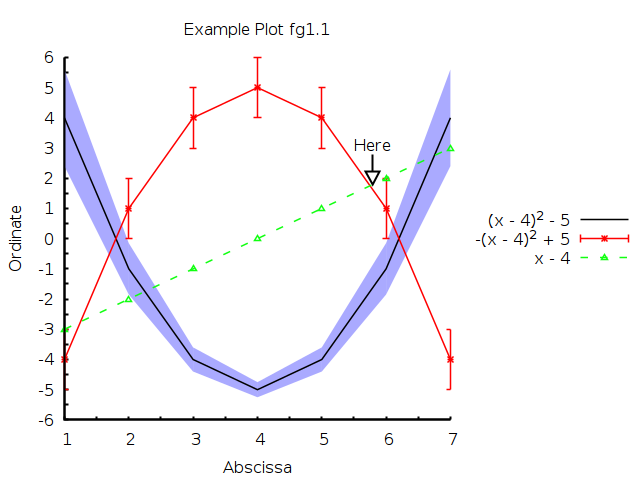

# RustGnuplot

A Gnuplot controller written in Rust.

[](https://travis-ci.org/SiegeLord/RustGnuplot)
[](https://crates.io/crates/gnuplot)

## Documentation

See [here](http://siegelord.github.io/RustGnuplot/doc/gnuplot/index.html)

## Examples

A somewhat involved 2D example:



## Features

* Simple 2D plots
	* lines
	* points
	* points + lines
	* error bars
	* ...and more!
* Simple 3D plots
	* surface plots
	* heatmaps
	* contours

## Building

### Via Cargo

```
cargo build
```
