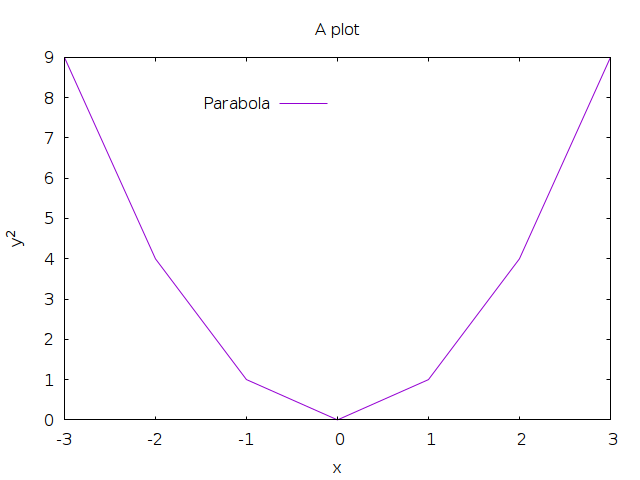

# RustGnuplot

A Gnuplot controller written in Rust.


[](https://crates.io/crates/gnuplot)

## Documentation

On [docs.rs](https://docs.rs/gnuplot/latest/gnuplot/)

## Examples

A simple example:

```rust
let mut fg = Figure::new();
fg.axes2d()
	.set_title("A plot", &[])
	.set_legend(Graph(0.5), Graph(0.9), &[], &[])
	.set_x_label("x", &[])
	.set_y_label("y^2", &[])
	.lines(
		&[-3., -2., -1., 0., 1., 2., 3.],
		&[9., 4., 1., 0., 1., 4., 9.],
		&[Caption("Parabola")],
	);
fg.show().unwrap();
```



A somewhat involved 2D example (see `example1.rs` in the `examples` directory):


## Features

* Simple 2D plots
	* lines
	* points
	* points + lines
	* error bars
	* ...and more!
* Simple 3D plots
	* surface plots
	* heatmaps
	* contours

## Building

### Via Cargo

```
cargo build
```

## Contributing

### Style

Please run `cargo fmt` before sending pull requests.

### Output tests

The CI verifies that the PNG outputs do not unexpectedly change for existing
examples. This is done by checking out the repository before your PR and after
the PR and comparing the outputs. If you changed some examples deliberately,
you can indicate this in the PR description by adding a line like:

```
CHANGED_OUTPUTS=image1.png,image2.png
```

where `image1` etc is derived from the string you pass to the `c.show(&mut fg,
"image1");` line in the example. To run the tests manually you run these two
commands (requires [uv](https://github.com/astral-sh/uv) to be installed):

```bash
source setup_venv.sh  # Do this once
. venv/bin/activate   # Do this if you already set up venv
./cargo_util.py --make_golden_outputs  # On the base commit (typically master)
./cargo_util.py --test_outputs --ignore_new_outputs --changed_outputs=image1.png,image2.png  # With your changes applied
```

We don't check in the golden outputs because gnuplot does not guarantee
cross-platform pixel-perfect outputs, so the outputs end up being specific to
the platform they're generated on. Thus, we only compare two commits instead on
the same platform (i.e. your local machine, or the CI runner).
